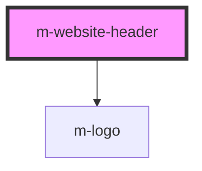

# m-website-header

<!-- Auto Generated Below -->

## Properties

| Property | Attribute | Description                                                                                                   | Type     | Default     |
| -------- | --------- | ------------------------------------------------------------------------------------------------------------- | -------- | ----------- |
| `items`  | `items`   | An array of items for the main navigation. Items have to include mandatory "label" and "href" fields to work. | `any`    | `undefined` |
| `name`   | `name`    | The user-friendly name of the U-M Library website that uses this Header.                                      | `string` | `undefined` |
| `to`     | `to`      | The URL that the logo and name link to.                                                                       | `string` | `"/"`       |

## Dependencies

### Depends on

- [m-logo](../logo)

### Graph

----------------------------------------------

*Built with [StencilJS](https://stenciljs.com/)*
